## 简介
 * TOC
 {:toc}


## 甘特图

### 图形方向

```text
graph TB
graph BT
graph RL
graph LR
```

| 用词 | 含义     |
| ---- | -------- |
| TD   | 从上到下同TB |
| TB   | 从上到下 |
| BT   | 从下到上 |
| RL   | 从右到左 |
| LR   | 从左到右 |


### 结点定义

- 节点定义

| 表述       | 说明                                                         |
| ---------- | ------------------------------------------------------------ |
| id[文字]   | 矩形节点                                                     |
| id(文字)   | 圆角矩形节点                                                 |
| id((文字)) | [圆形节点](https://www.zhihu.com/search?q=圆形节点&search_source=Entity&hybrid_search_source=Entity&hybrid_search_extra={"sourceType"%3A"article"%2C"sourceId"%3A139166407}) |
| id>文字]   | 右向旗帜状节点                                               |
| id{文字}   | 菱形节点     |
| id{/文字/}   | 平行四边形节点     |
| id[/文字\]   | 正梯形     |
| id[\文字/]   | 倒梯形     |
| id[[文字]   | 子例形     |
| id[(文字)]   | 圆柱形     |
| id([文字])   | 跑场形     |
| id{{文字}}   | 六边形M     |


### 结点连线类型

| 表述     | 说明           |
| -------- | -------------- |
| >        | 添加尾部箭头   |
| -        | 不添加尾部箭头 |
| ---       | 单线           |
| --text-- | 单线上加文字   |
| ==       | 粗线           |
| ==text== | 粗线加文字     |
| -.-      | 虚线           |
| -.text.- | 虚线加文字     |


#### TB案例

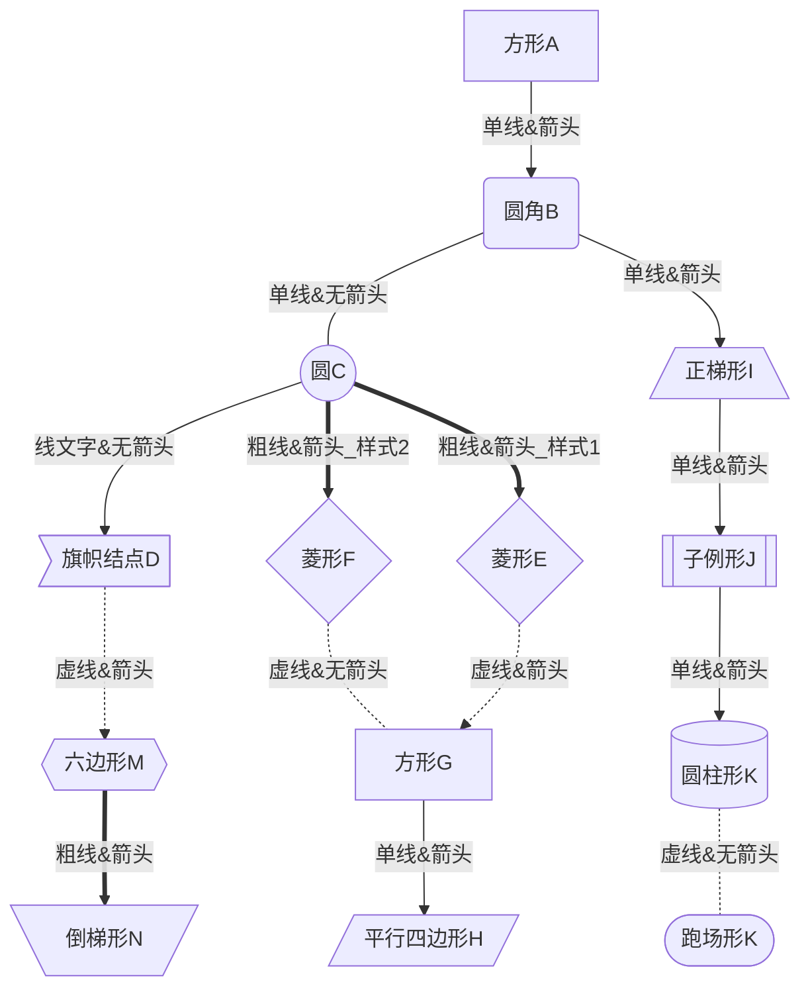


#### BT案例


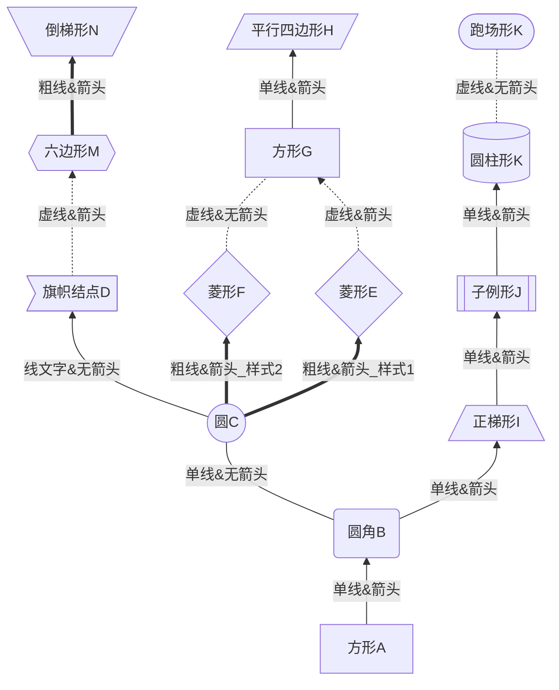


#### RL案例


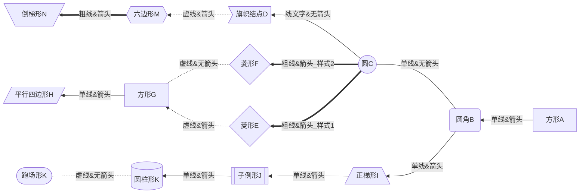


#### LR案例


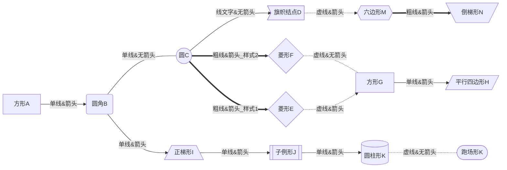


##  mermaid


### mermaid_graph_case1

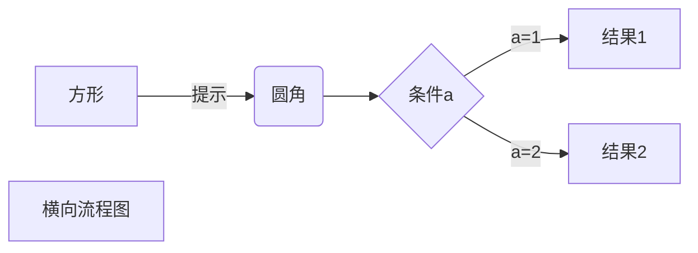


### mermaid_graph_case2

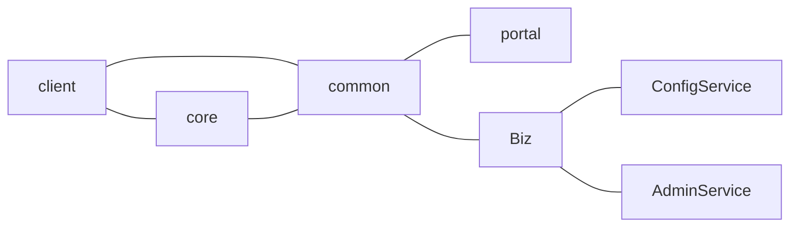


### mermaid_sequenceDiagram_case3

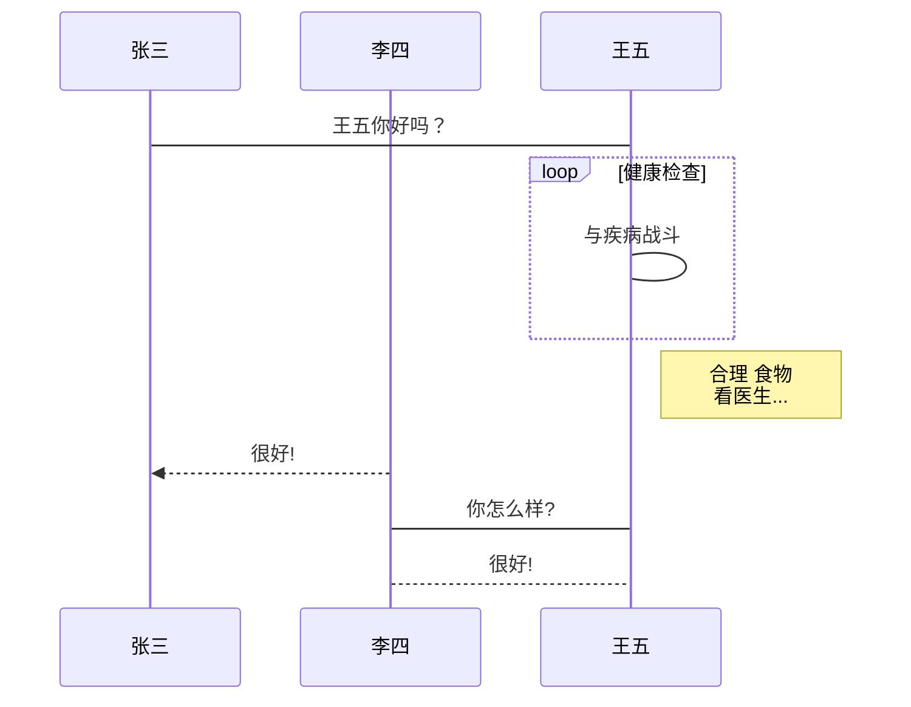


### mermaid_sequenceDiagram_case4

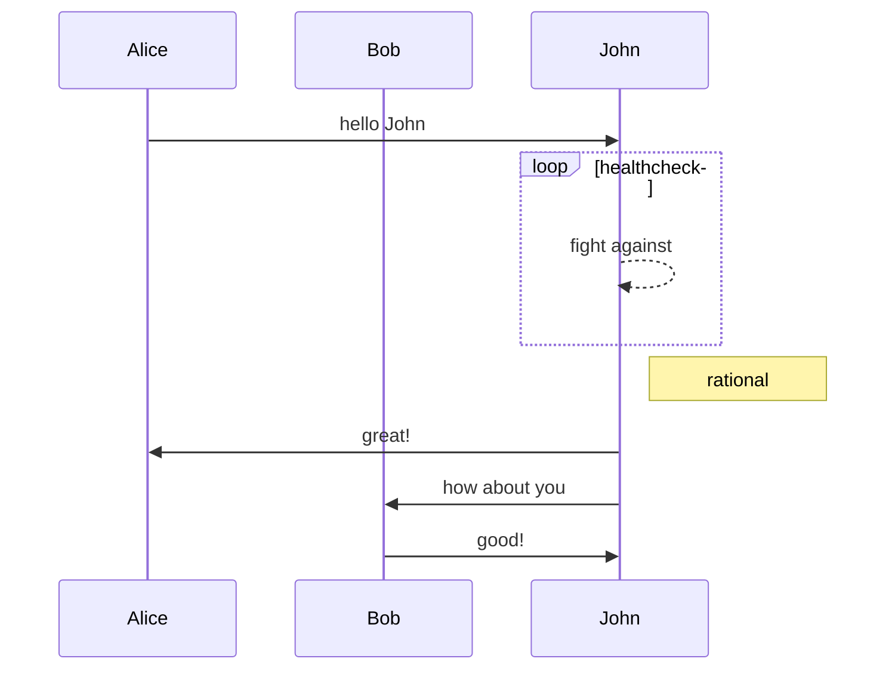


### mermaid_gantt_case5

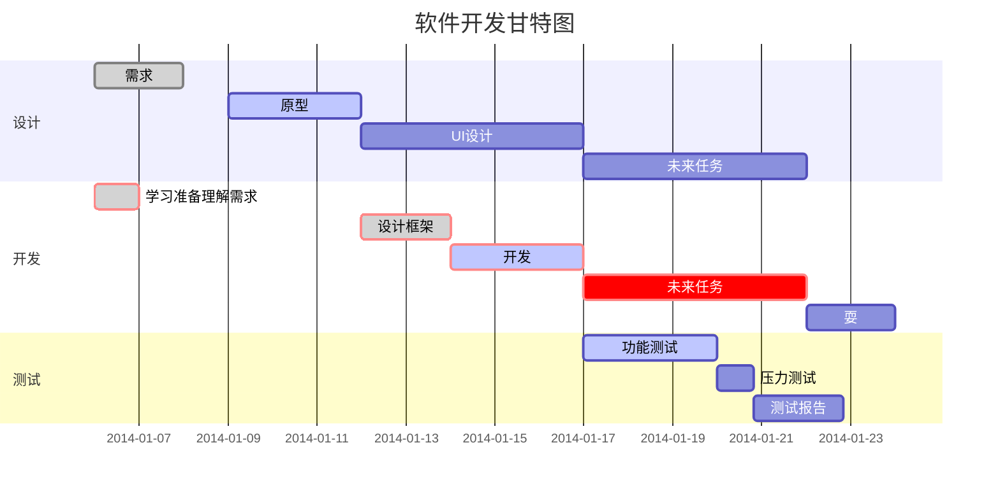


### mermaid_classDiagram_case6

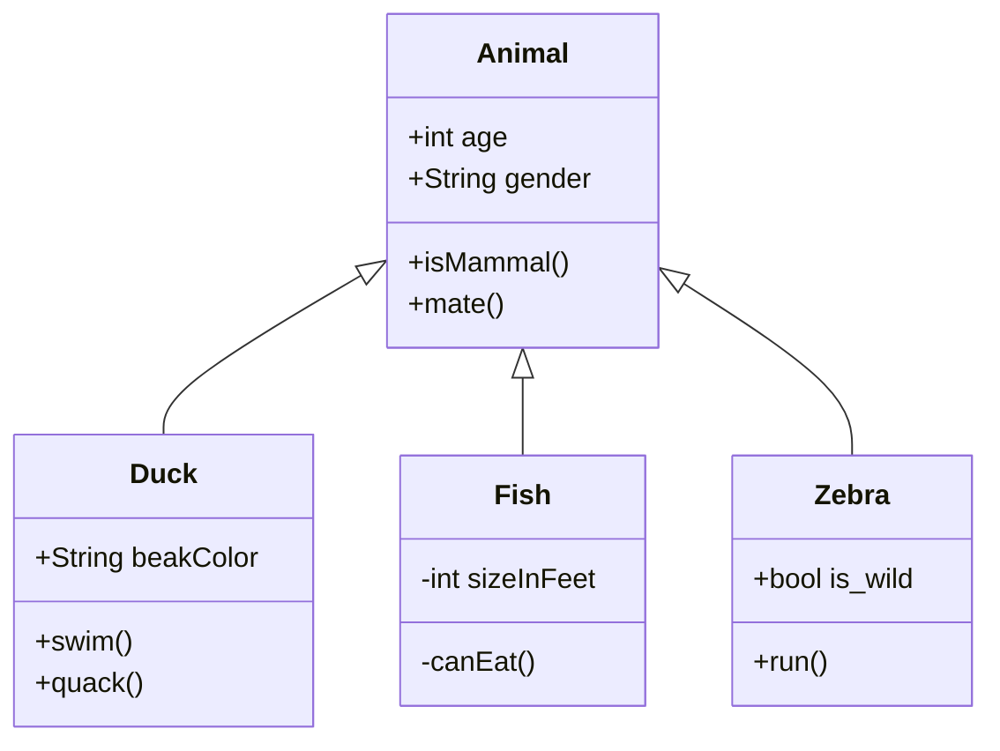


### mermaid_stateDiagram_case7

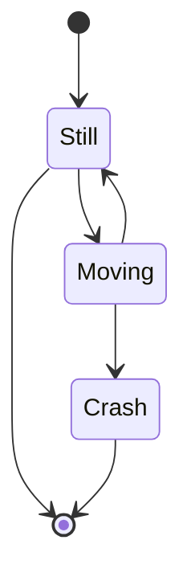


### mermaid_pie_case8

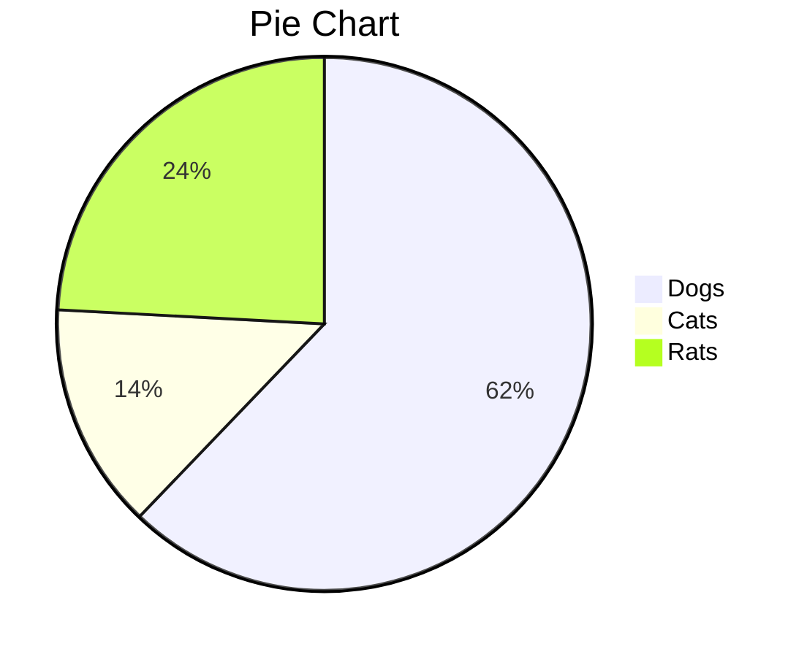


### mermaid_gitGraph_case9


## flow


### flow_case1

```flow

st=>start: 开始框

op=>operation: 处理框

cond=>condition: 判断框
(是或否?)

sub1=>subroutine: 子
流
程
  

io=>inputoutput: 输入输出框

e=>end: 结束框

st(right)->op(right)->cond

cond(yes)->io(bottom)->e

cond(no)->sub1(right)->op


```

## sequence

### sequence_case1


```sequence

Title: 标题：复杂使用

对象A->对象B: 对象B你好吗?（请求）

Note right of 对象B: 对象B的描述

Note left of 对象A: 对象A的描述(提示)

对象B-->对象A: 我很好(响应)

对象B->小三: 你好吗

小三-->>对象A: 对象B找我了

对象A->对象B: 你真的好吗？

Note over 小三,对象B: 我们是朋友

participant C

Note right of C: 没人陪我玩

```

